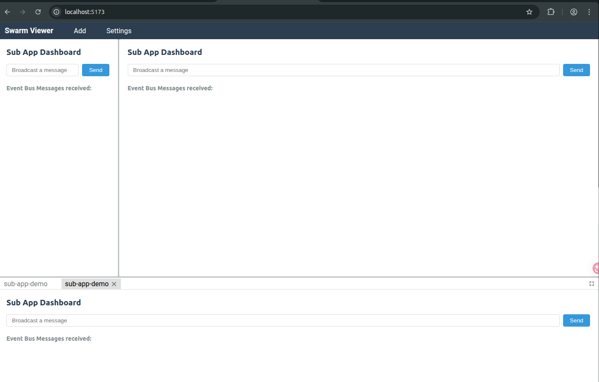

# Micro Panel Hub

Micro Panel Hub 是一个基于 `qiankun` 和 `flexlayout-react` 构建的微前端工作台容器。它既可以作为当前仓库里的独立站点运行，也可以作为 npm 包 `@shupeixuan/micro-panel-hub` 被其他 React 项目嵌入使用。

在线预览：`https://shupx.github.io/micro-panel-hub/`

最新构建归档：`https://github.com/shupx/micro-panel-hub/releases/tag/latest`



## 项目结构

- `main-app/`: 主应用与可发布库入口的源码
- `sub-app-demo/`: 示例微应用，用于本地开发和演示
- `lib/`: npm 包发布产物目录
- `dist/`: 站点构建产物目录

## 本地开发

安装依赖：

```bash
pnpm install
```

启动主应用和示例子应用：

```bash
pnpm dev
```

构建站点与 npm 库：

```bash
pnpm build
```

只构建 npm 库：

```bash
pnpm build:lib
```

只检查 npm 打包内容：

```bash
pnpm pack --dry-run
```

## 对外接口表

| 导出名 | 类型 | 用途 | 备注 |
| --- | --- | --- | --- |
| `MicroPanelHub` | React 组件 | 在 React 项目中直接渲染工作台 | 需要显式引入样式 |
| `mountMicroPanelHub` | 函数 | 在 DOM 容器上命令式挂载 | 内部仍基于 React 渲染 |
| `getDefaultEventBus` | 函数 | 获取默认事件总线实例 | 便于宿主复用消息通道 |
| `MicroPanelHubProps` | 类型 | 组件 props 类型 | 组件配置入口 |
| `MicroPanelHubMountOptions` | 类型 | `mountMicroPanelHub` 参数类型 | 与 props 基本一致 |
| `MicroPanelDefinition` | 类型 | 默认面板配置类型 | 供 `defaultPanels` 使用 |
| `MicroAppSource` | 类型 | 子应用来源配置类型 | 支持绝对路径和相对路径 |
| `MicroPanelHubEventBus` | 类型 | 事件总线类型 | 基于 `mitt` |
| `@shupeixuan/micro-panel-hub/styles.css` | 样式入口 | 引入组件样式 | 推荐宿主主动导入 |
| `@shupeixuan/micro-panel-hub/flexlayout-light.css` | 样式入口 | 引入 FlexLayout 默认主题样式 | 宿主需要单独覆写时可用 |

## 主要配置项

- `title`
- `defaultPanels`
- `defaultCustomAppName`
- `defaultRelativeRoute`
- `storageKey`
- `eventBus`
- `className`

## 作为 npm 包使用

安装：

```bash
pnpm add @shupeixuan/micro-panel-hub react react-dom
```

组件方式：

```tsx
import { MicroPanelHub } from "@shupeixuan/micro-panel-hub";
import "@shupeixuan/micro-panel-hub/styles.css";

export function Demo() {
  return (
    <div style={{ height: "100vh" }}>
      <MicroPanelHub
        title="Embedded Micro Panel Hub"
        defaultRelativeRoute="/sub-app-demo/"
        storageKey="embedded_micro_panel_hub_layout"
      />
    </div>
  );
}
```

命令式挂载：

```ts
import { mountMicroPanelHub } from "@shupeixuan/micro-panel-hub";
import "@shupeixuan/micro-panel-hub/styles.css";

const mounted = mountMicroPanelHub(document.getElementById("root")!, {
  title: "Embedded Micro Panel Hub",
});

mounted.unmount();
```

## 手动打包与上传 npmjs

1. 登录 npm 账号 `@shupeixuan` 对应的发布身份。

```bash
npm login
```

2. 安装依赖并构建发布产物。

```bash
pnpm install
pnpm build:lib
```

3. 先确认 npm 包内容。

```bash
pnpm pack --dry-run
```

4. 手动发布 dev 版本。

```bash
npm publish --access public
```

5. 如果只想发布某个 nightly/dev 版本，先把根 `package.json` 版本改成目标值，例如：

```text
1.0.0-dev.20260421.01
```

版本格式约定：

```text
1.0.0-dev.YYYYMMDD.SEQ
```

其中 `YYYYMMDD` 为 UTC 日期，`SEQ` 为两位序号，例如 `01`、`02`。

## GitHub Actions Trusted Publishing 配置

在启用 nightly 自动发布前，需要先完成以下配置：

1. 在 npm 包 `@shupeixuan/micro-panel-hub` 的 package settings 中添加 GitHub Trusted Publisher。
2. GitHub 仓库需要与 npm 包页面绑定到同一个仓库路径。
3. GitHub 侧创建 `npm` environment，供 nightly workflow 使用。
4. 首次发布 scoped 包时确认 package visibility 为 public。
5. nightly workflow 运行环境会使用 Node `22.14+` 和 npm `11.5.1+`，以满足 npm Trusted Publishing 的当前要求。

## 当前默认行为

- 默认标题：`Micro Panel Hub`
- 默认示例子应用入口：`/sub-app-demo/`
- 默认布局存储键：`micro_panel_hub_layout`
- 默认导出布局文件名：`micro-panel-hub-layout.json`
